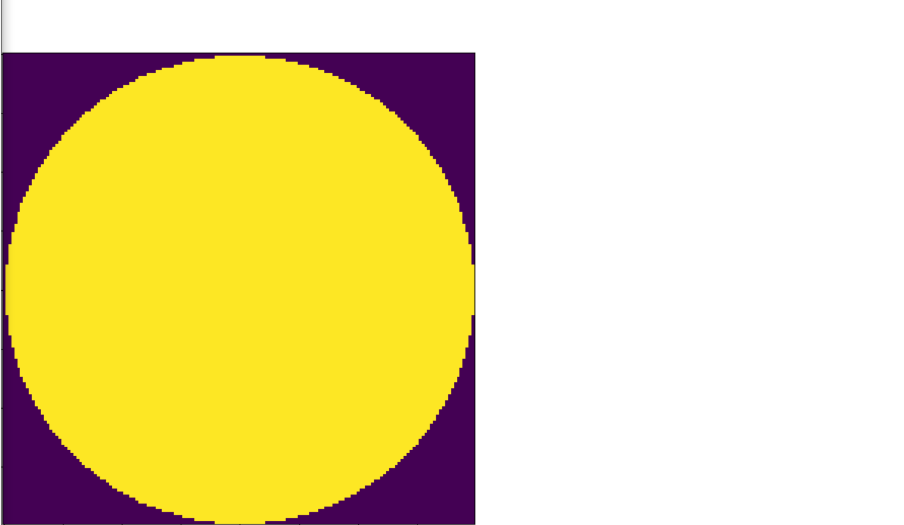

# Card-Detection
Senior Design project that detects cards in real time and clusters cards into hands

# Perks of YOLO
* Using YOLOv3, We were able to use this CNN for real time card detection. 
* The reason we implemented YOLO over other models such as Faster RCNN or RetinaNet is because YOLO is a quick network that helps with a faster FPS for the project.

# Training Process
* Trained on Synthetic Image Generation
* Generates weights after getting trained
* Uses transfer learning with DarkNet

# Synthetic Image Generation
Using edge detection, extracts cards and chips from images.

**Shows how it can extract a card an image**

**Shows how it can extract a chip from an image**

# Training Results

# Clustering
* Uses K means
* Clusters off of Bounding Boxes top left Point
* Puts X,Y coordinates into Klusters
* Ignores excess Bounding Boxes by filtering out the cards bottom right Bounding Box

# End Results
* Clusters nearest cards into hands

